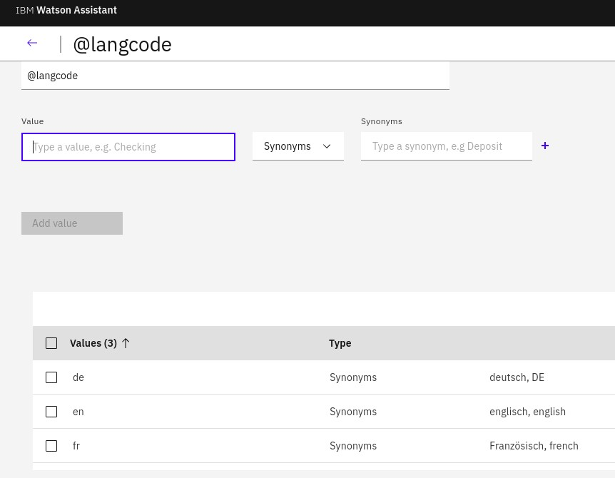
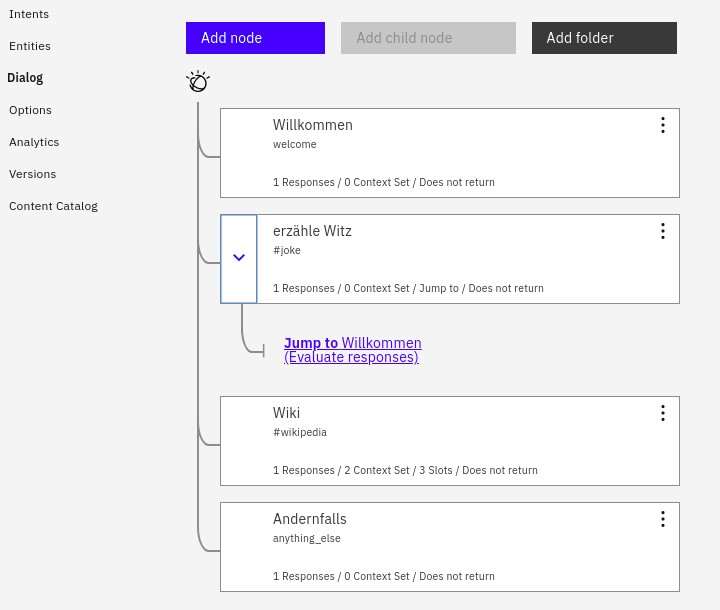
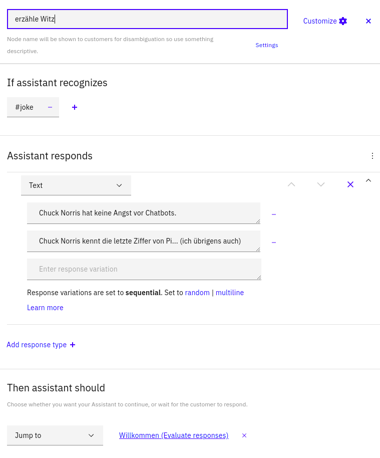
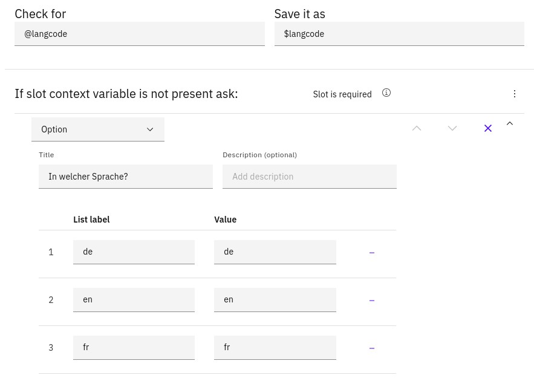
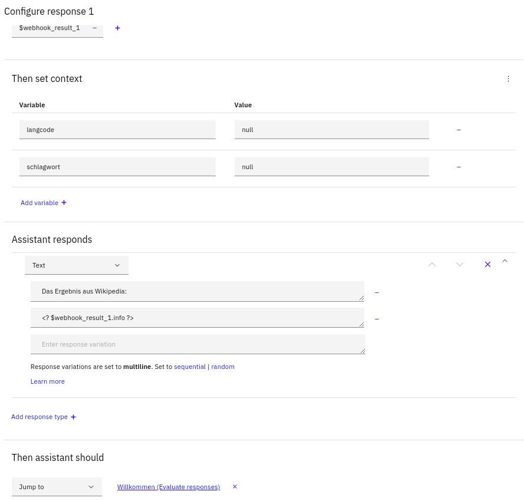
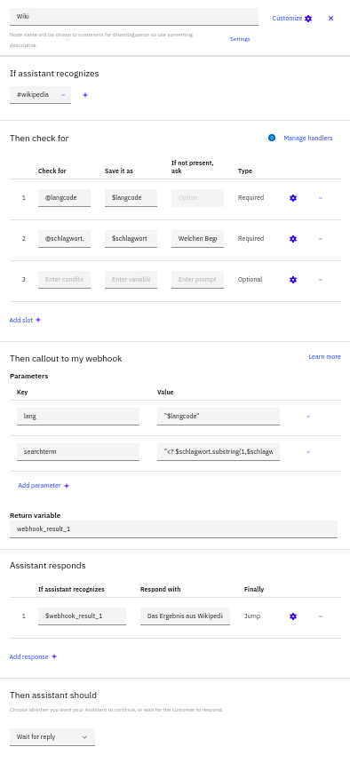
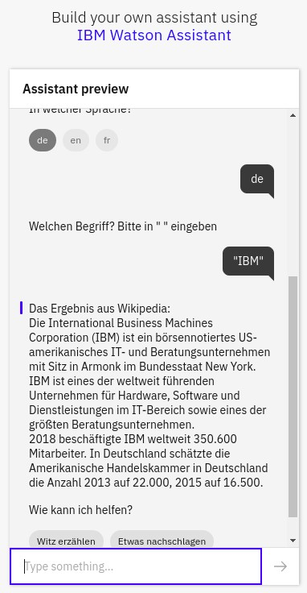

# Instructions for hands-on session

We are going to create a small chatbot which is able to either **tell a joke** or **look something up in Wikipedia**. 

Telling a joke is an example for detecting a specific intent or goal and then reacting with static responses. The responses can vary, e.g., the chatbot can print any joke from a given list. To be able to complete this task, the chatbot needs to detect the user's intent to have a joke told. Thus, we need to define an **intent** to match requests for a joke. Thereafter, we can define a **dialog node** which reacts to such a request and responds with a joke.

The second chatbot feature, looking something up in Wikipedia, is more complicated and shows dynamic answers based on external content. This is typical for most chatbots, especially in enterprise environments. For our bot, we will use **context variables** to capture the search term and the desired language for Wikipedia. We are going to use **slots** to gather input for the variables. Then, we need to reach out to Wikipedia to actually look up the term and return the result as chatbot answer. We are going to use a **webhook** calling out to a **Cloud Function** (see [the last section on how to create such a webhook](#create-a-cloud-functions-action-as-webhook)). That function will interact with Wikipedia and provide the result to the dialog. Instead of Wikipedia, we could call out to a database system, search engines, and more.


# Deploy

## Create Skill

### Short version (with pre-built skill)
Based on existing skill to import
1. Provision an instance of IBM Watson Assistance
2. Go to service dashboard and launch Watson Assistant
3. Create a new dialog skill by importing an existing skill. Use the file [skill-LMIdeutsch.json](skill-LMIdeutsch.json).
4. Click on options and change the webhook URI to your URI (either the one provided or [see below](#create-a-cloud-functions-action-as-webhook)).
5. Click on dialog and "Try" to test chatbot.

### Long version (build your own skill)
We are going to build the skill from scratch

Get started:
1. Provision an instance of IBM Watson Assistance
2. Go to service dashboard and launch Watson Assistant
3. Create new dialog skill, use German language
4. Go to Intents
5. Create an intent "#joke" with examples like "Tell me a joke" / "Erzähle mir einen Witz", "Do you know a joke" / "Kennst du Witze", ...
6. Create an intent "#wikipedia" with examples like "Look up in Wikipedia" / "Schau in Wikipedia nach", "Do you have a lexicon" / "Hast du ein Lexikon", ...
   
With some intents in place we already could build a dialog and use "Try it" to see whether the intents are detected. However, we are going to add two entities first.


1. Switch to Entities
2. Create an entity "@langcode" with values "de", "en", "fr" (or similar) and synonyms like "deutsch" for "de".   
   
3.  Create an entity "@schlagwort" with value "begriff" and based on a pattern. Use this as pattern (including quotes): `"([A-Za-z_ 0-9\.]*)"`.
4.  Switch to the Dialog pane
5.  Now it is to add two dialog nodes between the first and last node.
    

6.  Name the first dialog node "tell a joke" or "erzähle einen Witz". It needs to react to the intent "#joke". As response of type Text put in at least two jokes. When it is done, the dialog needs to "Jump to" a specific node and respond. Select the first node "Welcome" / "Willkommen" as target.
    

At this time, you could use the "Try it" button to test that telling a joke works as expected.


1.  Next, name the second dialog node "wikipedia" and make it react to the intent "#wikipedia". Click on the gear icon (customize) and enable slots and webhooks. Ignore the warning about the missing webhook URL.  
2.  Back in the node configuration, add two slots. In the first check for "@langcode" and save it to a variable "$langcode". Click on the gear icon to customize the slot. Switch from **Text** to **Option** as response type. Add three options with labels "de", "en", "fr" and the same as values. Use "In welcher Sprache?" / "Which language?" as title. Click **Save** to return to the dialog node form.

    
3.  In the second slot check for "@schlagwort.literal" and save it to "$schlagwort". Using ".literal" the entered text is saved, not the detected entity value which would be "begriff". If nothing is present, the chatbot should ask: *Welchen Begriff? Bitte in " " eingeben.*   
4.  Next, in the section for calling out to the webhook, two parameters are required. The first has the key `lang` and the value `$langcode`. The second has the key `searchterm` and the following expression as value:   
    ```
    "<? $schlagwort.substring(1,$schlagwort.length()-1) ?>"
    ```
5. The call to the webhook returns the result in the specified variable. Leave it as is.   
6. Click on the gear icon to open a form for the webhook-related settings. Then click on the three dots on the right and open the context editor.
7. Put in two rows and use "langcode" and "schlagwort" as variables and "null" as values. This resets the variables, so that the chatbot is able to ask for new values later on.
8. As the chatbot response of type Text add a first line as "Das Ergebnis aus Wikipedia:" and as second line "<? $webhook_result_1.info ?>". Enable a multiline reponse. The chatbot will print out the short intro on the first line. The second lise is the result from the webhook call, but only the value for the key "info".
9. Last, set how the bot should continue. Select "Jump to" and "evaluate response" and select the "Welcome" / "Willkommen" dialog node.
10. Click "Save" to return to the dialog node itself. You are done.

    

11. Finally, everything should look similar to this.

    

12. One more thing... Click on **Options** and change the webhook URI to your URI (either the one provided or [see below](#create-a-cloud-functions-action-as-webhook)).
13. There is even more. In the dialog, click on the "Welcome" / "Willkommen" node. Change the response type from **Text** to **Option**. Use "How can I help?" / "Wie kann ich helfen?" as title and add two options. The first has the label "Witz erzählen" ("tell a joke") and the value "erzähle einen Witz" ("tell me a joke"). The second option has the label "Etwas nachschlagen" ("look up a term") and the value "schau bei Wikipedia" ("search Wikipedia"). Save it. It adds clickable labels and hence enhances usability.


# Create Assistant
The skill can be tested on its own using "**Try it**". However, a chatbot consists of an assistant with one or more skill. Let's create the assistant.

1. Click on the **Assistants** icon in the menu on the left and switch to that tab.
2. Click **Create assistant**, put in a name (e.g. "LMIbot") and click **Create assistant**.
3. **Add dialog skill** and then select the previously created skill.
4. Next, you can add integrations, e.g., to Slack or Facebook. For this workshop we are done. Click on the **Preview Link** on the right. It brings up a new form to configure the preview link. Click on the URL to bring up the chatbot preview for testing. It looks like this:



# Test
In the preview window, try out the dialog by using the clickable options and by entering text. You can combine everything into a single sentence like:

> Schaue im deutschen Lexikon den Begriff "Quantum Computing" nach.


# Create a Cloud Functions action as webhook
Go to https://cloud.ibm.com/functions/actions and create a new Python 3.7 action by using the source from [wikiExtract.py](functions/wikiExtract.py). Once created, click on **Endpoints** and **Enable as Web Action**. After you save the changes, the URL for the webhook is shown. Use that URL plus the suffix `.json` in the skill **Options** to configure the webhook, e.g.,
`https://some-longer-url/wikiExtract.json`.

Note that webhooks configured through the UI are not secured. They can only be [protected through the CLI](https://cloud.ibm.com/docs/openwhisk?topic=cloud-functions-actions_web#actions_web_secure). **You should either disable the webhook after the tests again or secure them**.

You can find [code to interact with a database instead of Wikipedia in this repository](https://github.com/IBM-Cloud/slack-chatbot-database-watson). It is part of the [tutorial on building a database-driven Slackbot](https://cloud.ibm.com/docs/tutorials?topic=solution-tutorials-slack-chatbot-database-watson).